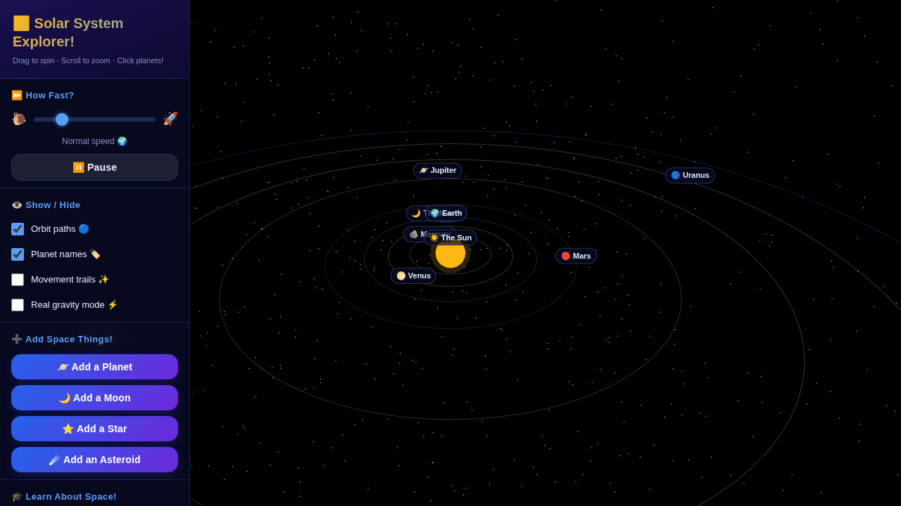
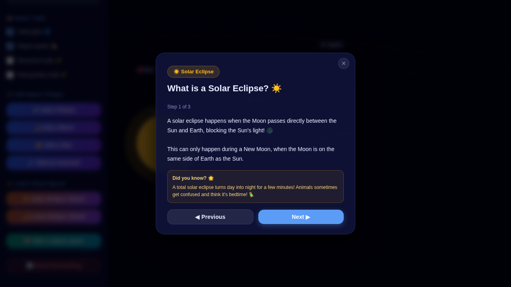
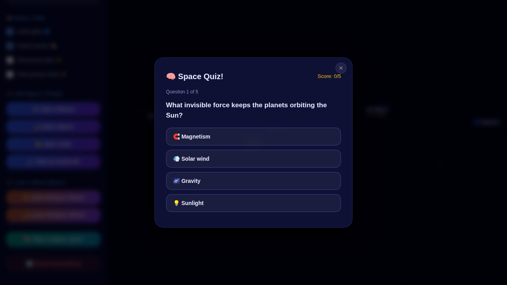
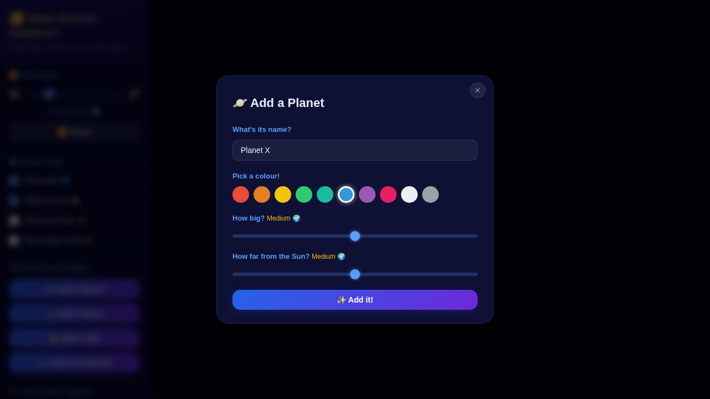

# 🌌 Solar System Explorer

A chaotic simulation engine to simulate gravitational interactions between celestial bodies 🪐

An interactive, educational Three.js simulation of our solar system — designed to be fun for everyone from 4th graders to adults!

---

## 📸 Screenshots

| | |
|---|---|
|  |  |
| *Main view — the full solar system in 3D* | *Solar Eclipse Show guided demonstration* |
|  |  |
| *Space Quiz with instant feedback* | *Add your own planet with a custom name and colour* |

---

## ✨ Features

| Feature | Description |
|---|---|
| 🌍 **Full solar system** | Sun + 8 planets + the Moon, with accurate relative orbital periods |
| ➕ **Add space things** | Add planets, moons, stars, or asteroids with custom names and colours |
| ⚡ **Real gravity mode** | Switch from stable Keplerian orbits to live N-body gravitational physics |
| ☀️ **Solar Eclipse show** | Step-by-step guided demonstration of a solar eclipse |
| 🌙 **Lunar Eclipse show** | Step-by-step guided demonstration of a lunar eclipse (with Blood Moon!) |
| 🧠 **Space Quiz** | 15-question bank covering planets, eclipses, gravity & more — auto-pops after 3 minutes |
| 🏷️ **Labels & Orbit paths** | Toggle planet names and orbit rings on/off |
| ✨ **Movement trails** | See where each body has been |
| 📷 **Camera follow** | Click any body → "Follow this body" to keep it centred |
| 📱 **Responsive** | Works on desktop and mobile |

---

## 🚀 Running the App

The app uses a **build process** (esbuild) to bundle Three.js and all assets into a single self-contained `index.html`. 

### Quick start

1. **Install dependencies:**
   ```bash
   npm install
   ```

2. **Build:**
   ```bash
   npm run build
   ```
   This creates a production `index.html` that works via `file://` or HTTP.

3. **Run:**
   - **Desktop:** Open the generated `index.html` directly in your browser (no server needed!)
   - **GitHub Pages (recommended):** Push to GitHub and enable **Pages → main branch / root**. The simulation will be live at `https://<your-username>.github.io/<repo-name>/`.

### Development (optional)

If you want to edit the source code and test locally without rebuilding every time, use a dev server with the source files:

```bash
# Python 3
python -m http.server 8080

# Node.js (npx)
npx serve .

# VS Code
# Install the "Live Server" extension, then right-click src/index.html → "Open with Live Server"
```

Then open `http://localhost:8080/src/` in your browser. The app will load Three.js from the CDN using the importmap for instant editing feedback.

---

## 🎮 Controls

| Action | How |
|---|---|
| **Orbit camera** | Click + drag |
| **Zoom** | Scroll wheel / pinch |
| **Pan** | Right-click + drag (or two-finger drag) |
| **Select a body** | Left-click on any planet or moon |
| **Follow a body** | Select it → "Follow this body" |

---

## 🎓 Educational Modes

### ☀️ Solar Eclipse Show
Click the button in the sidebar to watch a 3-step guided animation that explains:
1. What a solar eclipse is
2. How the Moon lines up between the Sun and Earth
3. What "totality" looks like and why it happens

### 🌙 Lunar Eclipse Show
Same guided format, explaining:
1. What a lunar eclipse is  
2. How Earth's shadow falls on the Moon
3. Why the Moon turns red ("Blood Moon") 🩸

### 🧠 Space Quiz
- Automatically prompts after **3 minutes** of exploring
- Can also be started anytime via the sidebar button
- **5 questions** randomly chosen from a bank of 15
- Topics: planets, eclipses, gravity, orbits, the Sun
- Instant feedback + score with ⭐ stars

---

## 🏗️ Project Structure

```
index.html        ← Main page
css/
  style.css       ← Space-themed UI styles
js/
  config.js       ← Body data, quiz questions, eclipse scripts
  scene.js        ← Three.js scene, camera, renderers
  bodies.js       ← CelestialBody class + BodyManager
  physics.js      ← Keplerian orbits + N-body gravity engine
  eclipse.js      ← Eclipse demonstration mode
  quiz.js         ← Quiz mode + timed notification
  ui.js           ← UI event handlers
  main.js         ← Entry point + animation loop
```

---

## 🛠️ Tech Stack

- **[Three.js r158](https://threejs.org/)** — 3D rendering (bundled locally via esbuild, no CDN dependency)
- **[esbuild](https://esbuild.github.io/)** — Build tool to bundle Three.js and source code into a production-ready `index.html`
- **CSS2DRenderer** — HTML labels anchored in 3D space
- **OrbitControls** — mouse/touch camera navigation
- Vanilla ES modules — easy development and modular code
